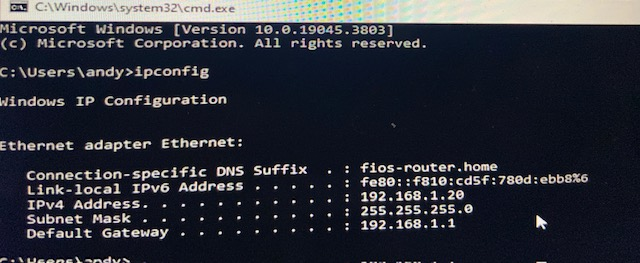
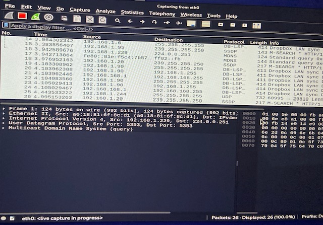
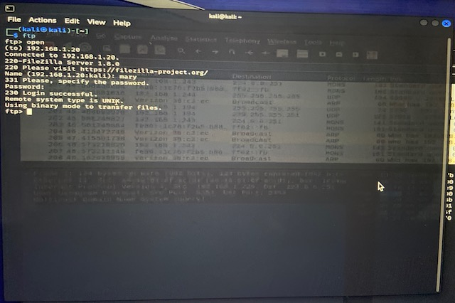
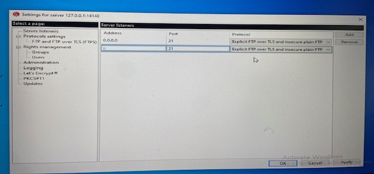
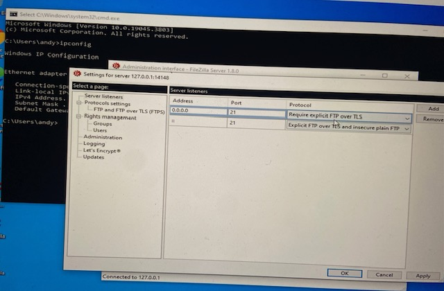

# Network-Traffic-Capture-Wireshark
Lab project demonstrating FTP traffic capture using Wireshark, showing credential exposure over plain FTP and mitigation with FTP over TLS.

<h2>Capturing FTP Credentials with Wireshark</h2>

<strong>Objective:</strong> 
Demonstrate how to use Wireshark to capture FTP traffic, showing the risks of unencrypted authentication and how enabling FTP over TLS mitigates them.

<strong>Tools Used:</strong> 
Windows 10, Oracle VirtualBox, FileZilla Server, Kali Linux, Wireshark

<h3>Steps Taken:</h3>
<ol>
  <li>Installed and configured <strong>FileZilla Server</strong> on Windows 10 VM.</li>
  <li>Under <em>Rights Management</em>, created a user account with a required password (<em>Screenshot 1</em>).</li>
  <li>Found the Windows VM IP address by running <code>ipconfig</code> in Command Prompt (<em>Screenshot 2</em>).</li>
  <li>On Kali Linux, opened <strong>Wireshark</strong> and started capturing traffic on <code>eth0</code> (<em>Screenshot 3</em>).</li>
  <li>From Kali terminal, connected to the FileZilla FTP server using the IP, username, and password (<em>Screenshot 4</em>).</li>
  <li>Observed in Wireshark that the username and password were transmitted in clear text under the FTP protocol (<em>Screenshot 5</em>).</li>
  <li>Modified FileZilla settings to <strong>Require explicit FTP over TLS</strong> to secure the authentication (<em>Screenshot 6</em>).</li>
</ol>

<h3>🔍 Observations:</h3>
<ul>
  <li>Plain FTP traffic exposes credentials in clear text, easily captured by Wireshark.</li>
  <li>Enabling FTP over TLS encrypts the authentication data, preventing password exposure.</li>
</ul>

<h3>✅ Outcome:</h3>
<ul>
  <li>Successfully demonstrated how unencrypted FTP traffic can leak credentials.</li>
  <li>Validated that enabling TLS secures FTP logins, aligning with security best practices.</li>
  <li>Relevant to SOC analyst and penetration tester workflows for identifying insecure services.</li>
</ul>

<h3>📷 Screenshots:</h3>
<ol>
  <li></li>
  <li></li>
  <li></li>
  <li></li>
  <li></li>
  <li></li>
</ol>
